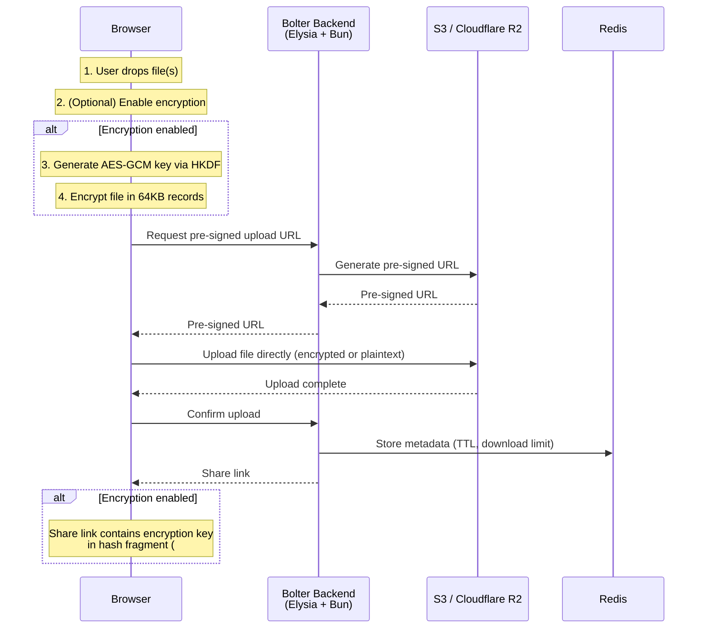

<p align="center">
  <h1 align="center">Bolter</h1>
  <p align="center">
    Fast, simple file sharing with optional end-to-end encryption. No accounts required.
  </p>
</p>

<p align="center">
  <a href="LICENSE"></a>
  
  
</p>

---

Bolter is a self-hostable file sharing app with optional end-to-end encryption. Share files with a link that automatically expires — no signups, no accounts. When encryption is enabled, files are encrypted in your browser before they ever leave your device, and the encryption key lives in the share link's hash fragment (never sent to the server).

## Features

- **Optional E2E encryption** — toggle on per-upload; AES-GCM with HKDF key derivation, entirely client-side via the Web Crypto API
- **Zero knowledge when encrypted** — the server never sees plaintext files or encryption keys
- **Files up to 1 TB** — multipart uploads with adaptive part sizing and resumability
- **Self-destructing links** — configurable expiration (5 min to 6 months) and download limits
- **No accounts required** — generate a link, share it, done
- **Resilient uploads** — stall detection, offline awareness, progress-based retries, and IndexedDB-backed resume on page reload
- **Adaptive speed** — preflight speed test measures your connection and picks optimal part sizes
- **Self-hostable** — Docker Compose, or run directly with Bun
- **Fully customizable** — white-label with your own branding, limits, and expiration options via environment variables

## How It Works



> Files are always uploaded directly to S3/R2 via pre-signed URLs — the server never handles file data. When encryption is enabled, the encryption key is embedded in the URL **hash fragment** (`#`), which browsers never include in HTTP requests. The server orchestrates uploads and tracks metadata (expiration, download count) but has **zero access** to file contents.

## Quick Start

### Prerequisites

- [Bun](https://bun.sh) v1.x
- [Redis](https://redis.io) (or use Docker)
- An S3-compatible object store ([Cloudflare R2](https://developers.cloudflare.com/r2/), [MinIO](https://min.io), AWS S3, etc.)

### Local Development

```bash
# Clone the repository
git clone https://github.com/slingshot/bolter.git
cd bolter

# Install dependencies
bun install

# Copy and configure environment variables
cp .env.example .env.local
# Edit .env.local with your S3/R2 credentials and Redis URL

# Start development (frontend + backend concurrently)
bun run dev
```

The frontend runs at `http://localhost:3000` and the backend at `http://localhost:3001`.

### Docker

```bash
# Copy and configure environment variables
cp .env.example .env

# Start all services (frontend, backend, Redis)
docker compose up
```

This starts:
- **Frontend** on port `3000` (Nginx serving the built SPA)
- **Backend** on port `3001` (Bun + Elysia)
- **Redis** on port `6379` (persistent, AOF-enabled)

> You still need to provide S3/R2 credentials in your `.env` file — Redis is included in the Compose stack but object storage is not.

## Architecture

Bolter is a **Turborepo monorepo** with three workspaces:

```
bolter/
├── apps/
│   ├── frontend/          # Vite + React 18 + Tailwind CSS
│   │   ├── src/
│   │   │   ├── components/   # Radix UI-based components
│   │   │   ├── lib/          # Crypto, API client, upload state
│   │   │   ├── pages/        # Home (upload) + Download pages
│   │   │   └── stores/       # Zustand state management
│   │   └── Dockerfile        # Multi-stage: Bun build → Nginx
│   │
│   └── backend/           # Elysia (Bun-native web framework)
│       ├── src/
│       │   ├── routes/       # Upload + download endpoints
│       │   ├── storage/      # S3 + Redis adapters
│       │   └── config.ts     # Convict-based env validation
│       └── Dockerfile        # Multi-stage: Bun slim
│
├── packages/
│   └── shared/            # Constants shared across workspaces
│       └── config.ts         # BYTES, UPLOAD_LIMITS, TIME_LIMITS, etc.
│
├── turbo.json             # Task pipeline (build, dev, typecheck)
├── biome.json             # Linter + formatter config
├── lefthook.yml           # Git hooks (pre-commit, commit-msg)
└── docker-compose.yml     # Full stack deployment
```

### Key Design Decisions

| Decision | Rationale |
|----------|-----------|
| **Bun runtime** | Native TypeScript execution, fast startup, built-in S3 compatibility |
| **Elysia framework** | Bun-optimized, end-to-end type safety, minimal overhead |
| **Direct S3 uploads** | Server never touches file data — pre-signed URLs let the browser upload directly |
| **Optional encryption** | Users choose per-upload; unencrypted shares are simpler, encrypted shares are zero-knowledge |
| **Web Crypto API** | Standards-based, hardware-accelerated encryption available in all modern browsers |
| **HKDF key derivation** | Derives separate keys for content and metadata from a single secret |
| **64KB record encryption** | Streaming-friendly — encrypt/decrypt without loading the entire file into memory |
| **IndexedDB resume state** | Multipart upload state survives page reloads; users can resume interrupted uploads |

## Configuration

All configuration is done via environment variables. See [`.env.example`](.env.example) for the full list.

### Required

| Variable | Description |
|----------|-------------|
| `S3_BUCKET` | S3/R2 bucket name |
| `S3_ENDPOINT` | S3/R2 endpoint URL |
| `AWS_ACCESS_KEY_ID` | S3/R2 access key |
| `AWS_SECRET_ACCESS_KEY` | S3/R2 secret key |

### Optional

| Variable | Default | Description |
|----------|---------|-------------|
| `REDIS_URL` | `redis://localhost:6379` | Redis connection string |
| `PORT` | `3001` | Backend server port |
| `BASE_URL` | `http://localhost:3001` | Public-facing base URL |
| `DETECT_BASE_URL` | `false` | Auto-detect base URL from request headers |
| `MAX_FILE_SIZE` | `1000000000000` (1 TB) | Maximum upload size in bytes |
| `MAX_FILES_PER_ARCHIVE` | `64` | Max files per upload |
| `MAX_EXPIRE_SECONDS` | `15552000` (6 months) | Maximum link expiration time |
| `DEFAULT_EXPIRE_SECONDS` | `86400` (1 day) | Default expiration |
| `MAX_DOWNLOADS` | `100` | Maximum download limit |
| `DEFAULT_DOWNLOADS` | `1` | Default download limit |

### White-Labeling

| Variable | Default | Description |
|----------|---------|-------------|
| `CUSTOM_TITLE` | `Slingshot Send` | App title (runtime, served via `/config`) |
| `CUSTOM_DESCRIPTION` | `Encrypt and send files...` | App description (runtime) |
| `VITE_APP_TITLE` | `Slingshot Send` | HTML `<title>` tag (build-time) |
| `VITE_APP_DESCRIPTION` | `Encrypt and send files...` | HTML `<meta>` description (build-time) |

> **Build-time vs runtime**: `VITE_*` variables are baked into the frontend at build time. `CUSTOM_*` variables are served by the backend's `/config` endpoint and override the build-time values at runtime.

## API Reference

| Method | Endpoint | Description |
|--------|----------|-------------|
| `GET` | `/health` | Full health check (Redis + S3 connectivity) |
| `GET` | `/config` | Client configuration (limits, defaults, branding) |
| `POST` | `/upload/url` | Request a pre-signed upload URL |
| `POST` | `/upload/multipart/:id` | Initiate a multipart upload |
| `POST` | `/upload/multipart/:id/resume` | List completed parts (for resuming uploads) |
| `POST` | `/upload/speedtest` | Generate pre-signed URLs for speed test |
| `POST` | `/upload/speedtest/cleanup` | Clean up speed test objects |
| `GET` | `/download/url/:id` | Get a pre-signed download URL |

## Development

```bash
# Install dependencies
bun install

# Run both frontend and backend
bun run dev

# Run individually
turbo run dev --filter=@bolter/frontend
turbo run dev --filter=@bolter/backend

# Type checking
bun run typecheck

# Lint + format (Biome)
bun run check

# Production build (Turborepo-cached)
bun run build
```

### Commit Conventions

This project uses [Conventional Commits](https://www.conventionalcommits.org/) enforced by [commitlint](https://commitlint.js.org/) and [lefthook](https://github.com/evilmartians/lefthook). Use the interactive commit helper:

```bash
bun run commit
```

## Deployment

### Docker Compose (recommended)

```bash
docker compose up -d
```

Includes health checks for all services. Customize limits and branding via environment variables in your `.env` file.

### Manual

```bash
# Build all workspaces
bun run build

# Start the backend
cd apps/backend && bun run start

# Serve the frontend (apps/frontend/dist) with any static file server
```

### Infrastructure Requirements

- **Object storage**: Any S3-compatible service (Cloudflare R2, AWS S3, MinIO, etc.)
- **Redis**: For metadata storage with TTL-based expiration (v7+ recommended)
- **Reverse proxy**: Recommended for production (Nginx, Caddy, etc.) to terminate TLS and serve the frontend

## Security

Bolter's security model is documented in detail in [`SECURITY.md`](SECURITY.md). The key points:

- Encryption is **opt-in per upload** — users toggle it on when needed
- When enabled, files are encrypted client-side with **AES-128-GCM** before upload
- Keys are derived via **HKDF** from a random 128-bit secret
- The encryption key lives in the URL **hash fragment** — never sent to the server
- The server only stores and serves **ciphertext** (when encrypted)
- Files auto-expire based on time or download count regardless of encryption

To report a vulnerability, see [`SECURITY.md`](SECURITY.md).

## Contributing

Contributions are welcome. Please read [`CONTRIBUTING.md`](CONTRIBUTING.md) for guidelines on development setup, code style, and the pull request process.

## License

[Mozilla Public License 2.0](LICENSE) — you can use, modify, and distribute Bolter freely. Modifications to MPL-covered files must remain open source; larger works can use any license.
