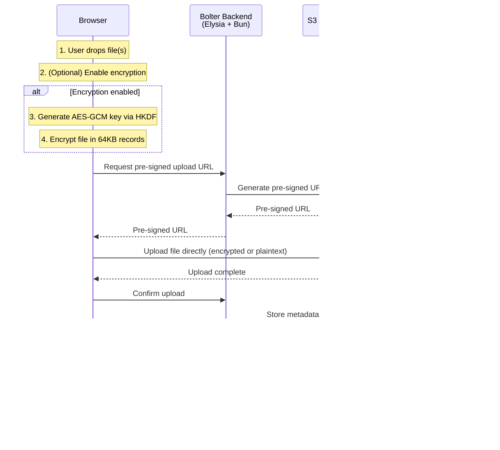

<p align="center">
  <h1 align="center">Bolter</h1>
  <p align="center">
    Fast, simple file sharing with optional end-to-end encryption. No accounts required.
  </p>
</p>

<p align="center">
  <a href="LICENSE"></a>
  
  
</p>

---

Bolter is a self-hostable file sharing app with optional end-to-end encryption. Share files with a link that automatically expires — no signups, no accounts. When encryption is enabled, files are encrypted in your browser before they ever leave your device, and the encryption key lives in the share link's hash fragment (never sent to the server).

## Features

- **Optional E2E encryption** — toggle on per-upload; AES-GCM with HKDF key derivation, entirely client-side via the Web Crypto API
- **Zero knowledge when encrypted** — the server never sees plaintext files or encryption keys
- **Files up to 1 TB** — multipart uploads with server-derived part sizing and resumability
- **Self-destructing links** — configurable expiration (5 min to 6 months) and download limits
- **No accounts required** — generate a link, share it, done
- **Resilient uploads** — multipart uploads run in a dedicated Web Worker with an OPFS staged-part store: byte-identical retries, wall-clock stall detection that survives background-tab throttling, crash/reload resume (including finishing an interrupted upload with no file re-selection, and replaying a completion whose response was lost), and one-click resume from persisted file handles on Chromium. The uploader pool sizes itself while the upload runs — it widens as long as it stays saturated and halves the moment the bucket answers with `429`/`503`, finishing any part already in flight rather than discarding its bytes. Environments without worker/OPFS support fall back automatically to the main-thread pipeline (stall detection, offline awareness, progress-based retries, IndexedDB-backed resume, Safari/WebKit empty-chunk filtering for HEIC/HEVC compatibility); setting `localStorage['bolter:upload-engine'] = 'off'` forces the fallback
- **Resilient downloads** — mid-stream failures resume via HTTP Range requests with stall detection and signed-URL refresh; every download is verified for completeness (and decryption integrity when encrypted) before it is reported successful
- **Streaming saves** — encrypted, zipped and legacy multi-file downloads write straight to disk (File System Access API, with a service-worker stream for Safari/Firefox) instead of being buffered in memory, and a download only counts against the share's limit once the save has actually landed
- **No preflight tax** — part size is derived from the file size on the server (`clamp(fileSize / 1000, 64 MiB, 128 MiB)`), so an upload starts on its first real byte instead of spending up to 10s and 500 MB measuring the connection first. R2 requires every non-trailing part to be the same size, so the choice cannot adapt mid-upload anyway
- **Multi-provider S3** — dynamic storage provider management via API; seamlessly migrate between S3-compatible services (Cloudflare R2, Railway, AWS S3, etc.) while existing files remain accessible on their original provider
- **Self-hostable** — Docker Compose, or run directly with Bun
- **Fully customizable** — white-label with your own branding, limits, and expiration options via environment variables

## How It Works


```mermaid
sequenceDiagram
    participant User as Browser
    participant Backend as Bolter Backend<br/>(Elysia + Bun)
    participant S3 as S3 / Cloudflare R2
    participant Redis as Redis

    Note over User: 1. User drops file(s)
    Note over User: 2. (Optional) Enable encryption

    alt Encryption enabled
        Note over User: 3. Generate AES-GCM key via HKDF
        Note over User: 4. Encrypt file in 64KB records
    end

    User->>Backend: Request pre-signed upload URL
    Backend->>S3: Generate pre-signed URL
    S3-->>Backend: Pre-signed URL
    Backend-->>User: Pre-signed URL

    User->>S3: Upload file directly (encrypted or plaintext)
    S3-->>User: Upload complete

    User->>Backend: Confirm upload
    Backend->>Redis: Store metadata (TTL, download limit)
    Backend-->>User: Share link

    alt Encryption enabled
        Note over User: Share link contains encryption key<br/>in hash fragment (#) — never sent to server
    end
```

> Files are always uploaded directly to S3/R2 via pre-signed URLs — the server never handles file data. When encryption is enabled, the encryption key is embedded in the URL **hash fragment** (`#`), which browsers never include in HTTP requests. The server orchestrates uploads and tracks metadata (expiration, download count) but has **zero access** to file contents.

## Quick Start

### Prerequisites

- [Bun](https://bun.sh) v1.x
- [Redis](https://redis.io) (or use Docker)
- An S3-compatible object store ([Cloudflare R2](https://developers.cloudflare.com/r2/), [MinIO](https://min.io), AWS S3, etc.)

### Local Development

```bash
# Clone the repository
git clone https://github.com/slingshot/bolter.git
cd bolter

# Install dependencies
bun install

# Copy and configure environment variables
cp .env.example .env.local
# Edit .env.local with your S3/R2 credentials and Redis URL.
# Set NODE_ENV=development so the API accepts the Vite dev server origin.

# Start development (frontend + backend concurrently)
bun run dev
```

The frontend runs at `http://localhost:3000` and the backend at `http://localhost:3001`.

### Docker

```bash
# Copy and configure environment variables
cp .env.example .env

# Start all services (frontend, backend, Redis)
docker compose up
```

This starts:
- **Frontend** on port `3000` (Nginx serving the built SPA)
- **Backend** on port `3001` (Bun + Elysia)
- **Redis** on port `6379` (persistent, AOF-enabled)

> You still need to provide S3/R2 credentials in your `.env` file — Redis is included in the Compose stack but object storage is not.

## Architecture

Bolter is a **Turborepo monorepo** with three workspaces:

```
bolter/
├── apps/
│   ├── frontend/          # Vite + React 18 + Tailwind CSS
│   │   ├── src/
│   │   │   ├── components/   # Radix UI-based components
│   │   │   ├── lib/          # Crypto, API client, upload state
│   │   │   │   └── upload-engine/  # Worker+OPFS multipart upload engine
│   │   │   ├── pages/        # Home (upload) + Download pages
│   │   │   └── stores/       # Zustand state management
│   │   └── Dockerfile        # Multi-stage: Bun build → Nginx
│   │
│   └── backend/           # Elysia (Bun-native web framework)
│       ├── src/
│       │   ├── routes/       # Upload + download endpoints
│       │   ├── storage/      # S3 + Redis adapters
│       │   └── config.ts     # Convict-based env validation
│       └── Dockerfile        # Multi-stage: Bun slim
│
├── packages/
│   └── shared/            # Constants shared across workspaces
│       └── config.ts         # BYTES, UPLOAD_LIMITS, TIME_LIMITS, etc.
│
├── turbo.json             # Task pipeline (build, dev, typecheck)
├── biome.json             # Linter + formatter config
├── lefthook.yml           # Git hooks (pre-commit, commit-msg)
└── docker-compose.yml     # Full stack deployment
```

### Key Design Decisions

| Decision | Rationale |
|----------|-----------|
| **Bun runtime** | Native TypeScript execution, fast startup, built-in S3 compatibility |
| **Elysia framework** | Bun-optimized, end-to-end type safety, minimal overhead |
| **Direct S3 uploads** | Server never touches file data — pre-signed URLs let the browser upload directly |
| **Optional encryption** | Users choose per-upload; unencrypted shares are simpler, encrypted shares are zero-knowledge |
| **Web Crypto API** | Standards-based, hardware-accelerated encryption available in all modern browsers |
| **HKDF key derivation** | Derives separate keys for content and metadata from a single secret |
| **64KB record encryption** | Streaming-friendly — encrypt/decrypt without loading the entire file into memory |
| **Worker+OPFS upload engine** | Multipart uploads produce, stage, and upload parts inside a dedicated Web Worker with an OPFS staged-part store — byte-identical retries, background-tab-safe wall-clock stall detection, staged ciphertext only for encrypted uploads, and crash-window resume without re-picking files. Ineligible environments (and the `localStorage['bolter:upload-engine'] = 'off'` kill switch) fall back to the retained main-thread pipeline |
| **IndexedDB resume state** | Multipart upload state survives page reloads; users can resume interrupted uploads (engine state lives in its own `bolter-upload-engine` database, separate from the legacy store) |
| **Streaming download sink** | Browser-processed downloads write through a `DownloadWriter` (File System Access → service worker → capped in-memory buffer) so a large file is never fully retained; the in-memory last resort is capped at 2 GiB and warns first |
| **Save before credit** | `/download/complete` is posted only after the save commits, so a failed or refused save can never consume one of a share's limited downloads |
| **Safari/WebKit compat** | Handles empty stream chunks from iOS HEIC/HEVC transcoding; pre-resolves transcoded file sizes for accurate part allocation |

## Configuration

All configuration is done via environment variables. See [`.env.example`](.env.example) for the full list.

### Required

| Variable | Description |
|----------|-------------|
| `S3_BUCKET` | S3/R2 bucket name |
| `S3_ENDPOINT` | S3/R2 endpoint URL |
| `AWS_ACCESS_KEY_ID` | S3/R2 access key |
| `AWS_SECRET_ACCESS_KEY` | S3/R2 secret key |

### Optional

| Variable | Default | Description |
|----------|---------|-------------|
| `REDIS_URL` | `redis://localhost:6379` | Redis connection string |
| `PORT` | `3001` | Backend server port |
| `BASE_URL` | `http://localhost:3001` | Public-facing base URL |
| `DETECT_BASE_URL` | `false` | Auto-detect base URL from request headers |
| `NODE_ENV` | `production` | One of `development`, `production`, `test`. Anything else — including unset — is treated as `production` |
| `CORS_ORIGINS` | _(none)_ | Extra browser origins allowed by CORS, comma separated (`BASE_URL` is always allowed) |
| `MAX_FILE_SIZE` | `1000000000000` (1 TB) | Maximum upload size in bytes |
| `MAX_FILES_PER_ARCHIVE` | `1000` | Max files per upload. Advertised by `GET /config` and enforced in two places: the upload button is disabled client-side before any bytes move, and `POST /upload/complete` refuses an over-limit unencrypted archive. Encrypted uploads carry an opaque metadata blob, so only the client gate applies to them. Raising it server-side takes effect with no frontend release |
| `MAX_METADATA_BYTES` | `524288` (512 KiB) | Byte ceiling on the base64 metadata blob stored per file. This is the resource `MAX_FILES_PER_ARCHIVE` was a proxy for — the blob lives in Redis and is re-served by `/metadata/:id` on every download-page load — and unlike the file count it also bounds encrypted shares. Keep it above `MAX_FILES_PER_ARCHIVE` × ~420 bytes |
| `MAX_REQUEST_BODY_BYTES` | `4194304` (4 MiB) | Global request-body ceiling. File bytes go straight to S3, so the API only receives JSON; Bun otherwise defaults to 128 MB for every route |
| `MAX_EXPIRE_SECONDS` | `15552000` (6 months) | Maximum link expiration time |
| `DEFAULT_EXPIRE_SECONDS` | `86400` (1 day) | Default expiration |
| `MAX_DOWNLOADS` | `100` | Maximum download limit |
| `DEFAULT_DOWNLOADS` | `1` | Default download limit |
| `PLAUSIBLE_DOMAINS` | `send.fm` | Site domains the analytics proxy will forward events for, comma separated |
| `TRUSTED_EDGE_CIDRS` | _(none)_ | CIDR ranges allowed to set `cf-connecting-ip`; when set, the header is only trusted from those peers |
| `HEALTH_CACHE_TTL_SECONDS` | `30` | How long a `/health*` probe result is reused. Set it to at least your orchestrator's probe interval |
| `HEALTH_PROBE_TIMEOUT_MS` | `2000` | Per-dependency budget for one health probe; a dependency that exceeds it is reported down |

> **Startup validation.** Every numeric variable above is parsed strictly at boot. Non-numeric (`abc`), unit-suffixed (`10GB`, `6months`), fractional, negative or out-of-range values abort startup with an explicit message instead of silently becoming `NaN` (which disables the limit) or a truncated integer. `S3_BUCKET` and `S3_ENDPOINT` must also be non-empty.

> **CORS fails closed.** `origin: true` with credentials is only enabled for an explicit `NODE_ENV=development` build. In every other case — including an unset or misspelled `NODE_ENV` — the API allows only `BASE_URL` plus `CORS_ORIGINS`, and never sends `Access-Control-Allow-Credentials`. For local development set `NODE_ENV=development` in your `.env.local`, or add `http://localhost:3000` to `CORS_ORIGINS`.

> **Health probes are bounded.** `/health`, `/health/ready` and `/__heartbeat__` are unauthenticated, so they check the **active** storage provider only (never every registered provider), give each dependency a `HEALTH_PROBE_TIMEOUT_MS` budget, and memoise the result for `HEALTH_CACHE_TTL_SECONDS`. A decommissioned bucket that black-holes connections therefore cannot stall readiness, and a probe flood cannot amplify into S3 API charges. If you poll more often than the default 30s TTL, lower `HEALTH_CACHE_TTL_SECONDS` to match; if you poll less often, raise it. `/health/live` never touches storage at all.

### Storage Provider Management

| Variable | Default | Description |
|----------|---------|-------------|
| `PROVIDER_ENCRYPTION_KEY` | _(none)_ | 32-byte hex key for AES-256-GCM encryption of provider secrets in Redis |
| `PROVIDER_CACHE_TTL_SECONDS` | `60` | How often to refresh the in-memory provider cache |
| `ADMIN_API_KEY` | _(none)_ | Bearer token for authenticating provider CRUD API requests |

### White-Labeling

| Variable | Default | Description |
|----------|---------|-------------|
| `CUSTOM_TITLE` | `Slingshot Send` | App title (runtime, served via `/config`) |
| `CUSTOM_DESCRIPTION` | `Encrypt and send files...` | App description (runtime) |
| `VITE_APP_TITLE` | `Slingshot Send` | HTML `<title>` tag (build-time) |
| `VITE_APP_DESCRIPTION` | `Encrypt and send files...` | HTML `<meta>` description (build-time) |

> **Build-time vs runtime**: `VITE_*` variables are baked into the frontend at build time. `CUSTOM_*` variables are served by the backend's `/config` endpoint and override the build-time values at runtime.

## API Reference

| Method | Endpoint | Description |
|--------|----------|-------------|
| `GET` | `/health` | Full health check (Redis + S3 connectivity) |
| `GET` | `/config` | Client configuration (limits, defaults, branding) |
| `POST` | `/upload/url` | Request a pre-signed upload URL |
| `POST` | `/upload/multipart/:id` | Initiate a multipart upload |
| `POST` | `/upload/multipart/:id/resume` | List completed parts (for resuming uploads) |
| `GET` | `/download/url/:id` | Get a pre-signed download URL (`410` once the download limit is reached) |
| `GET` | `/providers` | List all storage providers (admin) |
| `GET` | `/providers/:id` | Get storage provider details (admin) |
| `POST` | `/providers` | Add a new storage provider (admin) |
| `PUT` | `/providers/:id` | Update a storage provider (admin) |
| `DELETE` | `/providers/:id` | Remove a storage provider (admin) |
| `POST` | `/providers/:id/ping` | Health-check a provider (admin) |
| `POST` | `/providers/:id/activate` | Set provider as active upload target (admin) |

## Multi-Provider Storage

Bolter supports multiple S3-compatible storage providers simultaneously. This allows you to migrate between providers (e.g., Cloudflare R2 to Railway) without downtime — existing files remain accessible on their original provider while new uploads go to the new one.

### How it works

- On startup, the backend registers a **default provider** from environment variables (`S3_BUCKET`, `S3_ENDPOINT`, `AWS_ACCESS_KEY_ID`, `AWS_SECRET_ACCESS_KEY`). This is automatic and requires no configuration beyond the existing env vars.
- Every uploaded file records which provider it was uploaded to (`providerId` field in Redis metadata).
- Downloads resolve the correct provider from the file's metadata. Files uploaded before multi-provider support (no `providerId` field) fall back to the default provider.
- Additional providers can be added at runtime via the `/providers` API — no redeployment needed.
- Provider configurations are stored in Redis with secrets encrypted via AES-256-GCM (when `PROVIDER_ENCRYPTION_KEY` is set).
- Provider configs are cached in memory and refreshed from Redis on a configurable interval (default: 60 seconds).

### Authentication

All `/providers/*` endpoints require the `ADMIN_API_KEY` environment variable to be set. Requests must include the key as a Bearer token:

```
Authorization: Bearer <your-admin-api-key>
```

If `ADMIN_API_KEY` is not set, all provider management endpoints return `503 Service Unavailable`. This is by design — provider management is opt-in.

### Generating an encryption key

The `PROVIDER_ENCRYPTION_KEY` encrypts provider credentials (secret access keys) at rest in Redis. Generate one with:

```bash
openssl rand -hex 32
```

If not set, secrets are stored in plaintext (a warning is logged at startup). This is acceptable for local development but should be set in production.

### Managing providers

**List all providers:**
```bash
curl -H "Authorization: Bearer $ADMIN_API_KEY" http://localhost:3001/providers
```

**Add a new provider:**
```bash
curl -X POST http://localhost:3001/providers \
  -H "Authorization: Bearer $ADMIN_API_KEY" \
  -H "Content-Type: application/json" \
  -d '{
    "name": "Railway S3",
    "bucket": "my-railway-bucket",
    "endpoint": "https://s3.railway.app",
    "accessKeyId": "...",
    "secretAccessKey": "...",
    "region": "auto",
    "pathStyle": true,
    "isActive": true
  }'
```

Setting `isActive: true` makes this provider the target for all new uploads and deactivates the previously active provider.

**Activate an existing provider:**
```bash
curl -X POST -H "Authorization: Bearer $ADMIN_API_KEY" \
  http://localhost:3001/providers/railway-s3/activate
```

**Health-check a provider:**
```bash
curl -X POST -H "Authorization: Bearer $ADMIN_API_KEY" \
  http://localhost:3001/providers/railway-s3/ping
# Returns: { "healthy": true, "latencyMs": 45 }
```

**Delete a provider** (only if no active files reference it):
```bash
curl -X DELETE -H "Authorization: Bearer $ADMIN_API_KEY" \
  http://localhost:3001/providers/railway-s3
# Returns 409 if files still reference it. Use ?force=true to override.
```

> **Note:** The default provider (registered from env vars) cannot be deleted.

### Migration example: Cloudflare R2 to Railway

1. Deploy with existing env vars — the default provider (R2) is auto-registered. Zero behavior change.
2. Add the Railway provider via `POST /providers` with `"isActive": true`.
3. All new uploads now go to Railway. Existing R2 files continue to be served from R2.
4. R2 files naturally drain as they hit their TTL or download limits.
5. Once no files reference R2, the provider can be removed via `DELETE /providers/default`.

### Provider API response format

Secrets are never returned in API responses. The `accessKeyId` is masked (e.g., `AKIA****WXYZ`) and `secretAccessKey` is omitted entirely.

## Development

```bash
# Install dependencies
bun install

# Run both frontend and backend
bun run dev

# Run individually
turbo run dev --filter=@bolter/frontend
turbo run dev --filter=@bolter/backend

# Type checking
bun run typecheck

# Lint + format (Biome)
bun run check

# Production build (Turborepo-cached)
bun run build
```

### Commit Conventions

This project uses [Conventional Commits](https://www.conventionalcommits.org/) enforced by [commitlint](https://commitlint.js.org/) and [lefthook](https://github.com/evilmartians/lefthook). Use the interactive commit helper:

```bash
bun run commit
```

## Deployment

### Docker Compose (recommended)

```bash
docker compose up -d
```

Includes health checks for all services. Customize limits and branding via environment variables in your `.env` file.

### Manual

```bash
# Build all workspaces
bun run build

# Start the backend
cd apps/backend && bun run start

# Serve the frontend (apps/frontend/dist) with any static file server
```

### Infrastructure Requirements

- **Object storage**: Any S3-compatible service (Cloudflare R2, AWS S3, MinIO, etc.)
- **Redis**: For metadata storage with TTL-based expiration (v7+ recommended)
- **Reverse proxy**: Recommended for production (Nginx, Caddy, etc.) to terminate TLS and serve the frontend

### Operational requirements

These are configured on the **bucket**, not through environment variables. The backend's `/health` endpoint performs a server-side `HeadBucket` and cannot detect either of them, so a misconfigured bucket reports healthy and then fails at runtime.

#### 1. Bucket CORS policy (required)

The browser uploads and downloads directly against the bucket and reads response headers that S3/R2 only expose when the CORS policy says so:

- **`ETag`** is read after every multipart part completes. If it is not exposed, every upload large enough to go multipart fails — *after* all bytes have transferred — with a "bucket CORS misconfiguration" error.
- **`Content-Range`** is read when a mid-stream download failure is resumed with a `Range` request. If it is not exposed, resumable downloads fail with "Range resume mismatch".

```json
[
  {
    "AllowedOrigins": ["https://send.fm", "http://localhost:3000"],
    "AllowedMethods": ["PUT", "GET", "HEAD"],
    "AllowedHeaders": ["*"],
    "ExposeHeaders": ["ETag", "Content-Range", "Content-Length", "Accept-Ranges"],
    "MaxAgeSeconds": 3600
  }
]
```

`AllowedOrigins` must list every origin the frontend is served from — the same set you put in `CORS_ORIGINS`.

Apply it with the AWS CLI (works against R2 too):

```bash
aws s3api put-bucket-cors --bucket "$S3_BUCKET" --endpoint-url "$S3_ENDPOINT" \
  --cors-configuration file://bucket-cors.json
```

#### 2. `AbortIncompleteMultipartUpload` lifecycle rule (required)

Interrupted multipart uploads leave parts in the bucket that are invisible to `LIST` and billed indefinitely, and nothing in the application aborts them on the user's behalf. Configure a lifecycle rule:

```json
{
  "Rules": [
    {
      "ID": "abort-incomplete-multipart",
      "Status": "Enabled",
      "Filter": { "Prefix": "" },
      "AbortIncompleteMultipartUpload": { "DaysAfterInitiation": 7 }
    }
  ]
}
```

Per-file object expiry is enforced through the Redis metadata TTL; a coarse object-expiration lifecycle rule is recommended as a backstop so objects whose metadata has expired do not linger in the bucket.

## Security

Bolter's security model is documented in detail in [`SECURITY.md`](SECURITY.md). The key points:

- Encryption is **opt-in per upload** — users toggle it on when needed
- When enabled, files are encrypted client-side with **AES-128-GCM** before upload
- Keys are derived via **HKDF** from a random 128-bit secret
- The encryption key lives in the URL **hash fragment** — never sent to the server
- The server only stores and serves **ciphertext** (when encrypted)
- Files auto-expire based on time or download count regardless of encryption

To report a vulnerability, see [`SECURITY.md`](SECURITY.md).

## Contributing

Contributions are welcome. Please read [`CONTRIBUTING.md`](CONTRIBUTING.md) for guidelines on development setup, code style, and the pull request process.

## License

[Mozilla Public License 2.0](LICENSE) — you can use, modify, and distribute Bolter freely. Modifications to MPL-covered files must remain open source; larger works can use any license.
